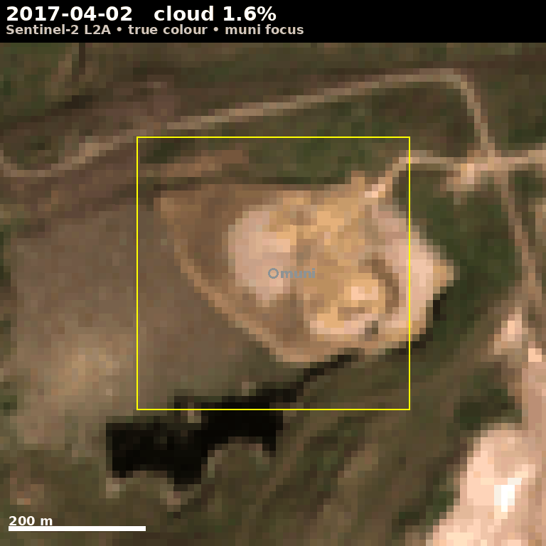
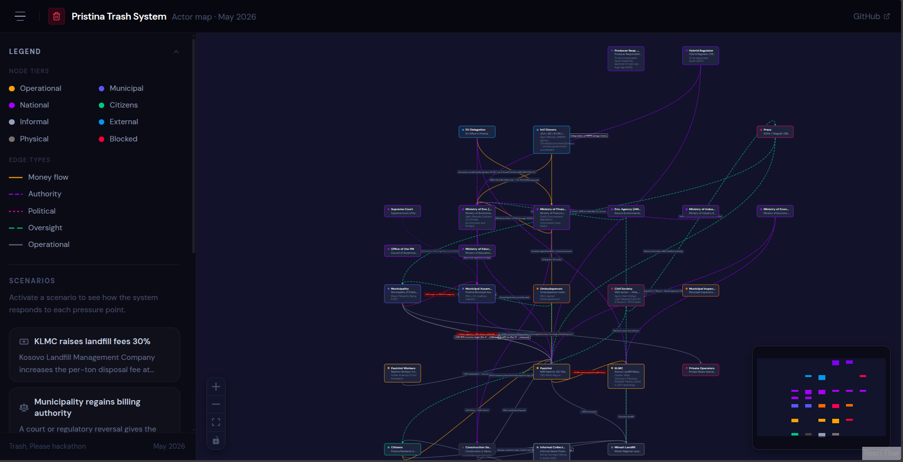
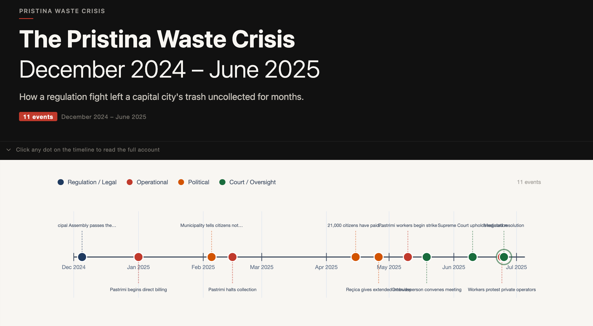

# Trash, Please

A weekend hackathon at Prishtina Hackerspace, May 9-10, 2026.
We're not going to fix Pristina's trash system. We're going to model it.

> **Background + framing:** [quarterly.systems/trash](https://quarterly.systems/trash/) (the opening presentation)

---

## The idea

Pristina's waste system is a multi-layer system: city operations, recycling streams, informal scavengers, EU compliance reporting. Every layer thinks it's the main story. None of them are. The whole thing is the story.

Complex systems are easier to play than read. So this weekend we built tools to understand how Pristina's trash actually works — from three angles at once: research the system, give citizens a way to report what's broken in it, and watch it from space.

This project exists alongside other civic-tech work — see [civic-tech-precedents.md](civic-tech-precedents.md) for the broader landscape.

## What's been built

Three project surfaces, attacking the same problem from different angles:

### 🔬 [`dossier/`](dossier/) — the research package

A structured, cross-linked research package on how Pristina's waste system actually operates. AI-assisted, source-cited, openly draft.

- **[`how-trash-works-pristina.md`](dossier/how-trash-works-pristina.md)** — the foundational dossier (operational + political layer; the 2024-2025 Pastrimi-Komuna dispute, named actors, citizen quotes)
- **[`timeline.md`](dossier/timeline.md)** — master chronology 2010-2027 (~95 dated events across 8 periods)
- **[`numbers.md`](dossier/numbers.md)** — canonical numbers reference (115 data points, 4 chart-ready time series)
- **[`law-diff.md`](dossier/law-diff.md)** — old Law 04/L-060 vs the upcoming new Law on Integrated Waste Management (13 dimensions diffed)
- **[`system-map.json`](dossier/system-map.json) + [`system-map.md`](dossier/system-map.md)** — graph data model (60 nodes, 90 edges; current state + post-new-law 2027 state)
- **[`sim-cards.md`](dossier/sim-cards.md)** — 21 policy levers as a card deck for the simulation (15 INDEP/KAS + 6 DYVÓ)
- **[`tensions.md`](dossier/tensions.md)** — cross-source reconciliation (where the dossier and enrichment disagree — and where they don't, despite appearances)
- **[`acronyms.md`](dossier/acronyms.md)** — glossary (~50 entries; resolves the KAS collision between Kosovo Statistics and Konrad-Adenauer-Stiftung)
- **5 enrichment summaries** (INDEP/KAS Apr 2026, GIZ MPG-CE, DYVÓ 2023 plastic research, Mazreku/MMPHI new-law deck, DYVÓ survey instrument)

Source materials in [`enrichment/`](enrichment/) — 5 documents (Albanian + English) contributed by Barlli at the start of the hackathon. Field imagery in [`prishtina-trash-images/`](prishtina-trash-images/) — photographs from Sunny Hill and UÇK Street by Bleron.

### 📱 [`hackthetrash/`](hackthetrash/) — the citizen reporting platform

End-to-end MVP for citizens reporting illegal dumps with photo + GPS. Production-grade infrastructure, built end-to-end during the weekend by sami and contributors.

| Public map | Photo-first /report | Authority Dashboard |
|---|---|---|
|  |  |  |

- **Web app** (Next.js 14 + TypeScript + TailwindCSS + Leaflet): landing, `/report`, `/map` (auto-refreshing public map), `/dashboard`, `/admin` panel
- **Mobile app** (React Native + Expo): native camera + GPS, OpenStreetMap layer in WebView, push notifications, offline submission queue
- **Backend** (Node.js + Express + PostgreSQL + PostGIS): full REST API, Sentinel-grade auth (bcrypt + JWT + brute-force protection + CORS allowlist + hardening headers)
- **Admin panel** with 4-action moderation, audit trail, AI image classifier (mock + HuggingFace pluggable)
- **i18n**: English + Albanian (Shqip), 111 translation keys, full UTF-8 diacritics
- **Pristina-only** scope: default centre 42.6629, 21.1655; demo seeds use Skanderbeg Square + Sunny Hill + UÇK Street; Komuna e Prishtinës as authority user

See [`hackthetrash/CHANGELOG.md`](hackthetrash/CHANGELOG.md) for the full v0.1.0 release notes.

### 🛰 [`TrashFromSpace/`](TrashFromSpace/) — the satellite monitoring pipeline

A free-Sentinel-2 pipeline for monitoring waste accumulations across Kosovo. 10m resolution, 5-day revisit, $0 imagery cost.

- **[`README.md`](TrashFromSpace/README.md)** — full pipeline spec with honest framing on what 10m resolution can/cannot detect
- **[`PHASES.md`](TrashFromSpace/PHASES.md)** — 6-phase project roadmap (known sites first, then candidates, then validation against AMMK)
- **[`known-sites.geojson`](TrashFromSpace/known-sites.geojson)** — 14 Kosovo waste sites (7 sanitary landfills + 4 non-sanitary + 3 recycling/processing facilities)
- **[`docs/PHASE1-PLAN.md`](TrashFromSpace/docs/PHASE1-PLAN.md)** — step-by-step Phase 1 build plan
- **Google Earth aerial views:** [Landfill in Landovicë](https://earth.google.com/web/search/42%2e255789,+20%2e700171/@42.25626622,20.70126828,393.82371163a,1008.0013057d,35y,0h,0t,0r/data=Cj4iJgokCbt39kAkVkVAEY08Eo0XVEVAGYaQ4fSiFTVAIX-G4bO0CjVAKhAIARIKMjAxMy0wNC0yNRgBQgIIAToDCgEwQgIIAEoNCP___________wEQAA?authuser=0) · [Mirash](https://earth.google.com/web/search/Deponia+e+mbeturinave+komunale,+Pristina/@42.66390519,21.06681019,524.32853775a,3037.28792639d,35y,0h,0t,0r/data=Cj4iJgokCQ0SjoCrV0VAETxAka2ZUEVAGRFTFJf_GzVAIVsjTeNJ9jRAKhAIARIKMjAyNS0wNy0xORgBQgIIAToDCgEwQgIIAEoNCP___________wEQAA?authuser=0)

#### Mirash deep-dive — [`landfill-timelapse/`](landfill-timelapse/) (Barlli — depth-first, merged via PR #46)

*Mirash 2017 → April 2026, monthly Sentinel-2 composites. The mound visibly grows north + east; the new groundwater pit appears NW from ~2020.*

Two iterations shipped, with substantive findings:

- **Iter 01** — 14 frames over 2017-2026, 2km AOI, true-colour + NDVI animations
- **Iter 02** — 35 frames, 800m muni-only AOI, true-colour + NDVI + BSI animations, full quantification
- **`landfill-timelapse/REPORT.md`** — 213-line analysis with these headline findings:
  - **NDVI inside the 400m ROI fell 77%** between 2017 and April 2026 (+0.258 → +0.060)
  - **Bare-ground area grew 72%** (87,400 m² → 150,300 m²) before the ROI saturated
  - **Step-change identified across 2021** — vegetation index falls off a cliff over a single year, calling for ground-truth on the cause (KLMC contract change? scavenger eviction? state-of-emergency expansion?)
  - **Water-vs-waste discrimination** working via BSI — a new groundwater-filled pit appeared NW of the muni pin from ~2020 onwards
- **Tooling note:** pure stdlib + numpy + Pillow + matplotlib. No GDAL, no API key. Data via Microsoft Planetary Computer STAC. ~90s per run.

### 🗺 [`trash-map/`](trash-map/) — the interactive viewer

An interactive web app that ingests the dossier and renders it as an explorable system map. Built by Barlli + Aldikrasniqi (merged via PR #46 alongside the timelapse work).

- Normalizes the dossier into a single `dossier.json` ("single source of truth")
- Collapsible stage row groups
- Rich actor preview panels with categorised edges per cell
- Node types: Operational / Municipal / National / Citizens / Informal / External / Physical / Blocked
- Edge types: Money flow / Authority / Political / Oversight / Operational
- Scenarios panel ("KLMC raises landfill fees 30%", "Municipality regains billing authority")
- Motion library for transitions (not plain CSS)

### 📅 [`dossier/timeline-app/`](dossier/timeline-app/) — the interactive crisis timeline

A scrollable D3.js timeline of the December 2024 – June 2025 Pastrimi-Komuna regulation crisis. 11 curated events, color-coded by type (regulation / operational / political / court), click any dot for the full account.

**Live app:** [vibes.diy/vibe/bestboy/pristina-waste-crisis](https://vibes.diy/vibe/bestboy/pristina-waste-crisis/)

Built with **[Vibes DIY](https://vibes.diy/)**. Source archived at [`dossier/timeline-app/App.jsx`](dossier/timeline-app/App.jsx) for forking. Companion to [`dossier/timeline.md`](dossier/timeline.md), focused specifically on the regulation-crisis arc.

## Active feature branches (not yet merged)

Substantive work-in-progress lives on these branches. The READMEs here will be updated as each one merges to main.

### 🗺 [`feat/interactive-map`](https://github.com/flosskosova/trash/tree/feat/interactive-map) — data structures scaffold (Aldikrasniqi)

Earlier version of the trash-map app focused on the data layer. Comprehensive structures for acronyms, edges, nodes, levers, tensions, recommendations, numerical figures. This branch is the base `feat/raci-matrix` was built on. May be effectively subsumed by the merged `trash-map/` work or hold remaining unmerged improvements — review when reactivated.

---

## Quick navigation by audience

**For researchers and policy folks** → start at [`dossier/how-trash-works-pristina.md`](dossier/how-trash-works-pristina.md) → then [`dossier/timeline.md`](dossier/timeline.md) → then the enrichment summaries.

**For app developers** → start at [`hackthetrash/README.md`](hackthetrash/README.md) → then [`hackthetrash/docs/api/API.md`](hackthetrash/docs/api/API.md) and [`hackthetrash/docs/architecture/ARCHITECTURE.md`](hackthetrash/docs/architecture/ARCHITECTURE.md).

**For Sim builders** → start at [`dossier/sim-cards.md`](dossier/sim-cards.md) → then [`dossier/system-map.json`](dossier/system-map.json) (the data model the Sim reads directly) → then [`dossier/law-diff.md`](dossier/law-diff.md) (every diff is a player-action card).

**For satellite-imagery folks** → start at [`TrashFromSpace/README.md`](TrashFromSpace/README.md) → then read Barlli's [`landfill-timelapse/REPORT.md`](landfill-timelapse/REPORT.md) (Mirash NDVI -77% over 9 years, with a step-change in 2021).

## Open verification questions

A handful of open issues track factual questions that need primary-source verification before we can publish numbers as canon:

- [#4](https://github.com/flosskosova/trash/issues/4) — Did the Deposit Refund System (DRS) actually launch January 2025?
- [#5](https://github.com/flosskosova/trash/issues/5) — Trepça lead battery recycling — current operating status?
- [#6](https://github.com/flosskosova/trash/issues/6) — Ujë Miros bottle reuse — actual scale or marketing claim?
- [#14](https://github.com/flosskosova/trash/issues/14) — Strategy 2024-2030 vs 2024-2035 — which dating is current?
- [#15](https://github.com/flosskosova/trash/issues/15) — Status of the new Law on Integrated Waste Management
- [#18](https://github.com/flosskosova/trash/issues/18) — Primary source library accessibility audit (10 sources, 6 confirmed accessible)

Contributions welcome on any of these — see issue thread for what to verify and where.

## The hackathon — what actually happened

**Saturday, May 9, 2026** — kickoff at Prishtina Hackerspace + remote on Mattermost. Tokens for the weekend were sponsored by **[Vibes DIY](https://vibes.diy/)**. Initial team breaks: research, app build, data extraction. By end of day: HackTheTrash MVP shipping; Barlli's enrichment material extracted into 5 structured summaries; original dossier landed.

**Sunday, May 10, 2026** — integration day. HackTheTrash hardens auth + admin panel + i18n. TrashFromSpace scaffolds + Phase 1 starts. Interactive map UI takes shape on a feature branch. Dossier package matures to 14 cross-linked files. Verification issues opened. RACI matrices distilled into a card deck for readability.

## Contributors

| Contributor | What they shipped |
|---|---|
| **[sami](https://github.com/samikciku)** (samikciku) | Built HackTheTrash end-to-end: web + mobile + backend + admin + i18n |
| **[kmikeym](https://github.com/kmikeym)** | Dossier package, RACI/Sim cards, TrashFromSpace scaffold, project framing |
| **[Barlli](https://github.com/Barlli)** | Enrichment source documents, Mirash time-lapse pipeline, interactive matrix UI |
| **[Aldikrasniqi](https://github.com/Aldikrasniqi)** | Interactive map data structures + UI motion library |
| **[Bleron Limani](https://github.com/bleroni)** (bleroni) | Field photographs of trash containers (Sunny Hill, UÇK Street) |
| **[Ari Karakushi](https://github.com/Aldikrasniqi)** | Geolocation prompt for the web app |

## Caveats

- The dossier is **AI-assisted** at multiple layers. Verify any factual claim against the cited primary source before publication.
- Several numbers are flagged as ⚠ (in active tension between sources) or ? (pending verification). See [`dossier/tensions.md`](dossier/tensions.md).
- Future-dated events (post-May 2026) are planned/announced. Verification status varies — see open issues.

## License

MIT. The hackathon was hosted by [FLOSSK](https://flossk.org) — Free Libre Open Source Software Kosova.

---

*Last updated: 2026-05-10 (Sunday afternoon of the hackathon weekend). The README will continue to drift as the work continues; this is a snapshot, not a contract.*
