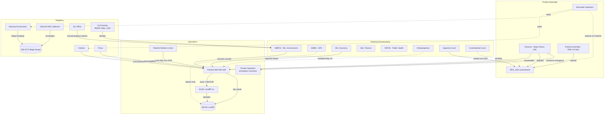
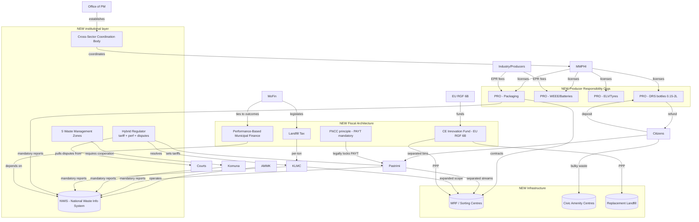

# System Map — Kosovo Waste System (Current State + Post-New-Law)

> Companion to `system-map.json`. Two graph snapshots of the Kosovo waste-management system: the 2024-2026 dispute equilibrium, and the post-new-law architecture coming online with secondary legislation in Feb-Mar 2027. Built for the hackathon Sim team.
>
> Source files: `raci/operational.md`, `raci/policy.md`, `raci/enforcement.md`, `raci/recommendations.md`, `enrichment-summary-mazreku-newlaw.md`, `how-trash-works-pristina.md`, `acronyms.md`.

---

## 1. Schema

`system-map.json` has four top-level keys.

### `states`

Two named states: `current` and `post_new_law_2027`.

`current` carries full `nodes` + `edges` lists. `post_new_law_2027` carries `added_nodes` + `added_edges` — meant to be **applied on top of** `current`. The Sim should construct the post-new-law graph as `current ∪ added` (the new law expands; it does not delete most existing actors, though many edges have `status` flips).

### Node fields

```
id          short stable code (use as graph key)
name        human label
type        ministry | agency | operator | municipality | court | civil_society |
            donor | citizen_class | infrastructure | policy | organization |
            regulator | fund
subtype     optional refinement (public/private/informal, ngo/think_tank/press,
            landfill/illegal_dump/mrf/cac/data_system, pro, zone, etc.)
tier        national | regional | municipal | international
status      ACTIVE | TO_FORM | TO_BUILD | TO_OPERATIONALIZE_2027 | PROPOSED | ...
parent      optional - parent ministry/agency
note        free text caveats
```

Plus type-specific quantitative fields (`employees`, `trucks_household`, `clients_self_count`, etc. on `PAS`).

### Edge fields

```
from        source node id
to          target node id
type        shareholder | appoints | regulates | licenses | contracts | pays |
            owes | taxes | fines | inspects | reports_to | disputes |
            advises | funds | donates | collects_from | separates_for
type_detail optional refinement (tipping_fee, tariff_setting, epr_fee,
            deposit, deposit_refund, performance_based, watchdog, ...)
status      ACTIVE | ACTIVE_WEAK | ACTIVE_POST_2025 | DISPUTED |
            EMERGENCY_FEB_JUN_2025 | TERMINATED_JUN_2025 | RULED_JUN_2025 |
            PENDING | INACTIVE | HISTORICAL | TO_OPERATIONALIZE_2027 |
            PROPOSED | INFERRED
value_eur               optional - one-time/total amount
value_eur_per_month     optional - recurring rate
note        free text; flag for INFERRED edges
```

Edges marked `status: INFERRED` are plausible-but-unstated relationships; flagged for verification.

### `policies`

10 entries describing the policy stack: DRS, EPR (packaging / WEEE / ELV / tyres), FNCC, source separation mandate, landfill tax, performance-based municipal financing, GPP, CDW 80% recovery, the disputed Pristina REG_2024.

### `transitions`

14 dated events that drive the move from `current` to `post_new_law_2027`. The Mazreku timeline is the spine: Government approval Q1 2026 → Assembly approval Q3 2026 → secondary legislation Q1 2027.

### `open_questions`

7 explicit verification gaps (Constitutional Court status, DRS launch readiness, strategy dating discrepancy, zone assignments, etc.).

---

## 2. Counts

| State | Nodes | Edges |
|---|---|---|
| `current` | 35 | 46 |
| `post_new_law_2027` (added on top) | +25 | +44 |
| Combined post-new-law graph | 60 | 90 |

---

## 3. Current state — diagram

Top-level actors and main flows. Not all 46 edges; ~20 of the load-bearing ones.



Read this diagram against `raci/operational.md` for cell-level R/A/C/I assignments. The dispute concentrates in a tight quadrant: tariff, registry, billing, tipping-fee debt. Operations (trucks, landfill mechanics) are clean.

---

## 4. Post-new-law state — what gets added

Same actors, plus new institutional architecture from Mazreku/MMPHI (Law on Integrated Waste Management).



Three structural shifts the Sim should know:

1. **The accountability vacuum closes** — Hybrid Regulator + strengthened Inspectorate + NWIS fill the "phantom A" cells from `raci/enforcement.md`.
2. **Money flow gets new rails** — EPR fees from producers, DRS deposits from citizens, landfill tax revenue, performance-based municipal transfers. The current flat-fee single-channel architecture becomes a multi-channel polluter-pays stack.
3. **Geography gets formal** — 5 Waste Management Zones override per-municipality fragmentation. Pristina's specific zone assignment is `open_questions`.

---

## 5. How the Sim could use this

Four concrete uses; treat the JSON as a live data model, not a doc.

**(a) Model a tariff increase.** Modify `current.edges[CIT→PAS:pays].value_eur_per_month` from 6.20 upward. Propagate to `PAS→KLM:owes` (capacity to pay tipping debt rises) and `PAS:revenue` (derived). In the post-new-law state the same lever moves to `HYBRID_REG→PAS:regulates(tariff_setting)` — Sim can compare "raise tariff via Assembly vote" vs "raise tariff via independent regulator decision" and see which path triggers PAS-UNION strikes.

**(b) Stress-test the registry gap.** The `PAS.clients_self_count` (95k) vs `KOM.clients_kom_count` (72k) split is a parameter on the PAS node. Closing it fully unlocks ~€3.5M/year per `how-trash-works-pristina.md`. Sim can bind this to a card "KOM registers 25k clients" and watch downstream effects on PAS-KLM debt and the Mirash tipping fee.

**(c) Sequence the new-law cards.** `recommendations.md` tail proposes Row 1 → Row 2 → Rows 5+10 → 3+4 → 7+8+11+13 → 6+9+12 → 14+15. Each row maps to a `policies[]` entry plus the relevant `post_new_law_2027.added_edges`. Players reorder cards; Sim re-evaluates whether the dependency graph is satisfied (e.g., `PERF_FINANCE` depends on `NWIS` operational; play `PERF_FINANCE` early without `NWIS` and the edge resolves to 0).

**(d) Add the Trash Reporter as a citizen channel.** Currently `CIT→PAS:reports_to` and `CIT→KOM:reports_to` are both `ACTIVE_WEAK`. The HackTheTrash app slots in as a new node `TRASH_REPORTER` with edges `CIT→TRASH_REPORTER:reports_to (structured)` and `TRASH_REPORTER→INSP:advises (auto-routes)` — boosting `INSP→CIT:fines` and `INSP→IND_CON:fines` from `ACTIVE_WEAK` to `ACTIVE`. In the post-new-law state, point `TRASH_REPORTER→NWIS:reports_to` and the app becomes the citizen-side front-end to the state's mandatory-reporting infrastructure.

---

## 6. RACI pointer

Cell-level role assignments (R/A/C/I) live in:

- `raci/operational.md` — collection, billing, landfill (Layer 1, the dispute)
- `raci/policy.md` — strategy, DRS, EPR, EU acquis (Layer 2, the reforms queued)
- `raci/enforcement.md` — inspection, sanctions, audit (Layer 3, the phantom-A layer)
- `raci/recommendations.md` — 15 INDEP/KAS levers × actors (View C, the card deck)

When Sim logic needs to know *who plays what role* for an edge, look up the corresponding row in those matrices. The JSON encodes the relationship; the RACI encodes the role.

---

*Built 2026-05-09. Snapshot will drift — re-extract when (a) Mazreku Assembly approval lands Aug-Sep 2026 or (b) secondary legislation lands Feb-Mar 2027.*
